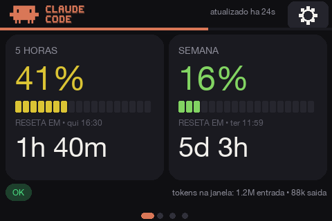
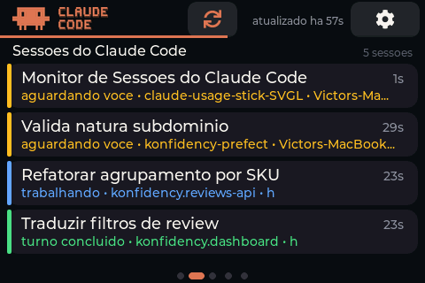
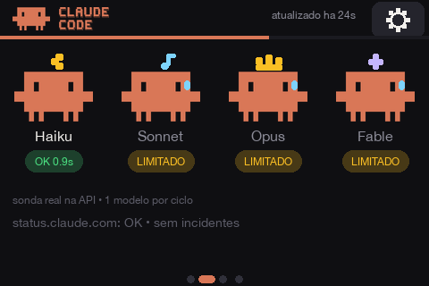
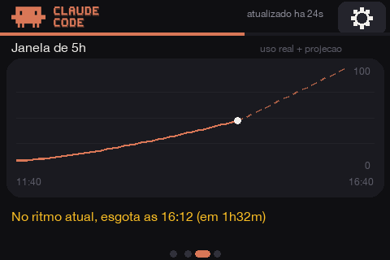
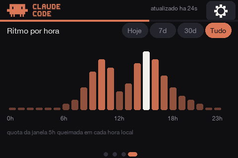
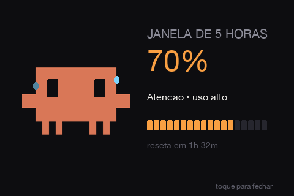

# Claude Usage Stick — touch screen (ESP32-S3 + LVGL)

A desk gadget that shows your **Claude Code rate-limit usage** in real time on a 3.5" touch
screen. No computer, no app, no cloud: the device queries Anthropic's API directly, reads usage
straight from the response headers, and renders it all on a friendly dashboard — with animated
**Clawd** mascots, a usage trend chart, an hour-of-day heatmap and reset clocks.

<p align="center">
  
</p>

> 100% touch navigation (swipe ← → between screens, no physical button). Adapted from the original
> **Claude Usage Stick** project (a multi-board firmware with physical buttons) to run **on this
> screen only** — see [What came from the original project](#what-came-from-the-original-project).

> The on-screen UI is in Portuguese (the author's language). This README documents it in English;
> screenshot labels are referenced where useful.

---

## Screens

> The **Sessions** shot is a real capture off the device — `GET /screenshot` dumps the
> framebuffer and [`tools/grab_screen.py`](tools/grab_screen.py) turns it into a PNG:
> `python3 tools/grab_screen.py assets/screen-sessoes.png`. The rest are still hand-drawn
> mockups (`python3 tools/gen_mockups.py`) and can drift from the firmware — they substitute
> HelveticaNeue for LVGL's Montserrat. Prefer `grab_screen.py` for anything new.

Navigate by **swiping** (the dots at the bottom show your position; the active one becomes a
pill). The **gear** opens Settings. The thin **coral bar** below the header counts down to the
next refresh — tapping it refreshes immediately.

### 1. Now (*Agora*)


- Two big cards: **5-hour window** and **week (7-day) window**.
- Each card: large percentage and an **18-segment meter** whose lit segments (and the number)
  slide continuously from **green through amber to red** as the window fills, plus a **large live
  countdown** to the reset and the **local reset time**.
- Bottom strip: overall **status chip** (`OK` / `ATENCAO` / `BLOQUEADO`) and, when the
  [token bridge](#tokens-per-session-optional-bridge) is running, the **real token counts** for
  the current 5 h window.

<br clear="right">

### 2. Sessions (*Sessoes do Claude Code*)


- One **card per running Claude Code session**, pushed from your Mac by
  [hooks](#claude-code-sessions-hooks) — the Anthropic API does not expose sessions, so this is
  local state.
- A **colored side bar** carries the state, readable across the room without focusing:
  🔵 **blue (pulsing)** `trabalhando` — Claude is working ·
  🟡 **amber** `aguardando voce` — Claude is waiting on you ·
  🟢 **green** `turno concluido` — turn finished ·
  ⚪ **gray** `sem sinal ha 10min` — no event for 10 min (derived on-device, dimmed).
- Sorted by **actionability**, not by time: `waiting → working → done → stale`. The card that
  needs you is always in the same place — that is the whole point of glancing at the device.
- Each card shows the **project** (basename of `cwd`) and **time since the last event**
  (`2m14s`, `1h03m`). The 8-char session id only appears when two cards share a project name, and
  the host only when more than one machine is reporting.
- Up to 6 sessions (4 visible, scroll for the rest). Empty state shows a resting Clawd.

<br clear="right">

### 3. Models (*Modelos*)


- The 4 Clawd mascots (Haiku / Sonnet / Opus / Fable) with a **live status pill** under each one,
  fed by a **real probe against the API** (one model per refresh cycle, rotating):
  `OK 0.9s` (green, with latency) · `LIMITADO` (amber, HTTP 429) · `ERRO` (red, 5xx/network) ·
  `N/D` / `--` (gray). The mascot goes gray when the model is unreachable or under incident.
- An **incident line** from `status.claude.com` (is the problem you or Anthropic?).

<br clear="right">

### 4. 5-hour window (*Janela de 5h*)


- Custom chart with the **X axis spanning exactly the current 5 h window** (start → reset).
- Solid coral line = real usage history; **dotted line = projection** at the current burn rate.
- Plain-language verdict, color-coded: *"At the current rate, runs out at 16:40 (in 1h32m)"*
  (amber/red) or *"Does NOT run out before the reset (~62%)"* (green).

<br clear="right">

### 5. Hourly rhythm (*Ritmo por hora*)


- **Usage by hour of day**: 24 bars whose height/brightness show which hours burn the most quota;
  the current hour is highlighted.
- **Period selector** at the top: **Hoje / 7d / 30d / Tudo** (today, last 7 days, last 30 days,
  all time). Per-day history is **persisted to flash** (31 days on the device).

<br clear="right">

### Threshold moments (animations)


Whenever a window crosses **25 % / 50 % / 70 % / 100 %**, a full-screen animated "moment" pops
up (8 combinations: 4 thresholds × 2 windows): the official pixel-art **Clawd** drops in and
reacts to the level — relaxed at 25 %, focused with a sweat drop at 50 %, wide-eyed and shaking
at 70 %, grayed-out with X eyes and a blinking red ring at 100 % — while the percentage counts
up and a segment meter lights up. Tap to dismiss (auto-closes after ~4.5 s).

> **Double-tap the Clawd icon or the CLAUDE CODE wordmark** to preview the 8 animations in sequence. The **refresh button** sits at the center of the header (the thin coral bar below it is just the countdown indicator).

The header and the token/loading screens use the **official Claude Code pixel logo** (SVGs in
`assets/brand/`, converted to embedded LVGL images by `tools/gen_logo_assets.py`).

<br clear="right">

### Settings (*Ajustes*)

Opened from the gear (scrollable list, 44 px touch rows):

- **Refresh now** — forces a refresh.
- **Refresh interval** — 30 s / 1 min / 2 min / 5 min (tap to cycle; saved to NVS).
- **Slideshow** — auto-advances the screens; tap to cycle **off / 5 s / 10 s / 15 s / 30 s**
  (pauses for 10 s after any touch).
- **Timezone: GMT±N** — adjusts the timezone (tap to cycle; fixes the reset clocks).
- **Brightness** — low / medium / high (backlight PWM).
- **Configure WiFi** — re-scan + password on screen.
- **Change token** — reopens the web token entry.
- **Language** — Portuguese / English, applied to the whole UI (saved to NVS).
- **About** — device info, display model and developer credits.
- **Erase everything** — factory reset (2 taps to confirm).

The error screen carries a **Settings** button too. You only land there with WiFi *associated*
(without a connection the PIN screen routes straight to WiFi setup), which is exactly the
captive-portal case — associated, but the API unreachable. Without that button, changing network
or token would mean power-cycling the board.

---

## Hardware

| | |
|---|---|
| Screen | **Mini ESP32-S3 3.5" Capacitive Touch IPS · 480×320 · 8 MB PSRAM · 16 MB Flash** ([AliExpress](https://pt.aliexpress.com/item/1005007641039070.html)) |
| Chip | ESP32-S3 (native USB) |
| Display | **AXS15231B**, QSPI interface |
| Touch | **AXS15231B** capacitive, I²C `0x3B` |

> **OPI PSRAM is mandatory** — the 480×320 LVGL buffer doesn't fit in internal RAM.

Pins and the validated display/color/touch configuration are in
[`firmware/REFERENCIA-HARDWARE-LVGL.md`](firmware/REFERENCIA-HARDWARE-LVGL.md) and the reference
bring-up sketch in [`firmware/bringup/`](firmware/bringup/).

### 3D-printable case

A ready-to-print case for this display board is included:
[`3D Case/Case_JC3248W535C.stl`](3D%20Case/Case_JC3248W535C.stl) — print it, slide the board in
and the Usage Stick is desk-ready.

---

## How it works (and the token)

The gadget makes a **minimal** `POST` (`max_tokens: 1`) to
`https://api.anthropic.com/v1/messages` and **doesn't use the response body** — it reads usage
straight from the headers:

```
anthropic-ratelimit-unified-status                allowed | allowed_warning | rejected
anthropic-ratelimit-unified-5h-utilization        0–1   (becomes the 5-hour window %)
anthropic-ratelimit-unified-5h-reset              epoch
anthropic-ratelimit-unified-7d-utilization        0–1   (7-day window)
anthropic-ratelimit-unified-7d-reset              epoch
anthropic-ratelimit-unified-representative-claim  five_hour | seven_day  (what limits you first)
anthropic-ratelimit-unified-fallback-percentage
anthropic-ratelimit-unified-overage-status / -overage-disabled-reason
```

Model health combines `status.claude.com/api/v2/incidents/unresolved.json` (incidents) with a
**per-model probe**: each refresh cycle the device sends one `max_tokens: 1` request to the next
model in the rotation (Haiku → Sonnet → Opus → Fable) and records the HTTP code + latency. That's
what feeds the colored status pills on the Models screen.

### Tokens per session (optional bridge)

The API does **not** expose token counts for subscription accounts — the `unified-*` headers only
carry utilization percentages, and `/api/oauth/usage` requires the `user:profile` scope (the
`setup-token` only has `user:inference`) and still returns percentages. The real numbers live in
the **local Claude Code transcripts** (`~/.claude/projects/**/*.jsonl`).

[`tools/token_bridge.py`](tools/token_bridge.py) (stdlib only) closes that gap: it asks the device
for the current window (`GET http://claude-stick.local/window`), sums the transcript `usage`
entries since the window start (deduped by message id) and pushes them back
(`POST /tokens`). The "Now" screen then shows *"tokens na janela: 1.2M entrada • 88k saida"*.

```bash
python3 tools/token_bridge.py               # one shot
python3 tools/token_bridge.py --loop 120    # keep pushing every 2 min
```

The device advertises itself via mDNS as **`claude-stick.local`** and keeps the data server
listening on **every screen** (not just the dashboard), so pushes never hit a closed port. It is
a passive receiver: after a reboot its session list is empty and only refills as new hook events
arrive — an idle session stays invisible until you touch it again. If the
row disappears, the data just went stale (> 15 min without a push).

### Claude Code sessions (hooks)

The Sessions screen is fed by **Claude Code hooks** rather than polling. Polling
`~/.claude/projects/**/*.jsonl` works but cannot tell `waiting` from `done` — in both cases the
assistant turn simply ended. Hooks separate exactly those two states, and they push instead of
poll:

| Hook | Status sent | Meaning |
|---|---|---|
| `UserPromptSubmit` | `working` | you sent a prompt, Claude is working |
| `PermissionRequest` | `waiting` | Claude is blocked on a permission decision |
| `PostToolUse` | `working` | a tool ran, so Claude is going again |
| `Notification` | `waiting` | idle prompt (Claude finished, you haven't replied) |
| `Stop` | `done` | the turn finished |
| `SessionEnd` | `gone` | removes the card |

`PermissionRequest` — not `Notification` — is what fires when Claude asks for permission. This
was **measured**, not read off the docs: a temporary hook logging raw stdin showed
`PermissionRequest` firing and `Notification` staying silent. It is not noisy either — a
read-only command auto-approved by the sandbox produces no event at all.

`PostToolUse` exists only to undo the amber: without it a card stays "waiting" for the rest of
the turn after you grant permission. It fires often, but a heartbeat that does not change the
status causes **no redraw** — the device only rebuilds the card list when the composition or a
status actually changes.

**1. Install the script**

```bash
cp tools/stick-notify.sh ~/.claude/stick-notify.sh && chmod +x ~/.claude/stick-notify.sh
```

**No address to configure.** The script tries four candidates in order, cheapest first:

| | | |
|---|---|---|
| 1 | `/tmp/.stick-ip` | the last IP that worked — the fast path |
| 2 | USB serial | the device announcing its own IP over the cable |
| 3 | `~/.claude/stick-host` | a pinned IP, for a device on the network with neither cable nor mDNS |
| 4 | mDNS | discovery |

**None of them is binding.** An address is only valid while it answers, so a failure always
falls through to the next one and the delivery still happens on that same event — no lost
notification, no waiting for the breaker. That matters in both directions: change networks and
the stale cache self-corrects; forget a pinned IP behind and the cable or mDNS takes over
instead of blinding the bridge forever. A candidate only counts as delivered on `HTTP 2xx` —
any other answer is some *other* host that inherited the lease, and caching it would poison the
highest-priority candidate.

mDNS discovery goes through `ping`, not `curl`, because macOS `getaddrinfo` takes ~2.8 s to
resolve a `.local` name (it tries unicast DNS first) and that blows the short timeout hooks
require; `ping` answers in ~80 ms by talking to mDNSResponder directly. The script resolves
first and hands a bare IP to `curl`.

**Why the cable ranks above both.** Corporate and coworking networks often put devices on a
separate VLAN. Routing still works — a WeWork setup measured here had the Mac on `10.14.120.x`,
the stick on `10.14.89.x`, `HTTP 200` in 0.15 s — but multicast does not cross VLANs, so mDNS
finds nothing. What is missing there is not reach, it is *discovery*. So the firmware announces
`[NET] ip=<ip>` on serial every 5 s, and the script reads it straight off the port: the only
candidate DHCP cannot invalidate, and it carries identity for free — the address came from the
device itself, not from a name any host on the network could have answered.

It is read-only by design. Asking the device on demand would mean opening the port for
**writing**, and the ESP32-S3 USB-Serial-JTAG ROM enters download mode via DTR/RTS — which is
exactly why `flash.sh` uploads without asking you to hold BOOT. A hook-triggered reset would
land on the PIN screen mid-session. A 5 s wait costs nothing because discovery already runs in
the background block.

**When to pin an IP.** Only when the stick is on the network but out of reach of both — on a
charger instead of the Mac, on a foreign VLAN. Write the IP into `~/.claude/stick-host`; read it
off **Settings → Change token**, which shows `http://<ip>` on screen. `CLAUDE_STICK_HOST` does
the same for one session; `CLAUDE_STICK_NAME` changes the mDNS name. The pin is manual and rots
on its own when the lease changes, so it is the last resort, not the first.

**2. Register the hooks** in `~/.claude/settings.json` (absolute paths — `~` is only expanded
because the command runs through a shell, so do not rely on it):

```json
{
  "hooks": {
    "UserPromptSubmit":  [{ "hooks": [{ "type": "command", "command": "/Users/you/.claude/stick-notify.sh working", "async": true }] }],
    "PermissionRequest": [{ "matcher": "*",
                            "hooks": [{ "type": "command", "command": "/Users/you/.claude/stick-notify.sh waiting", "async": true }] }],
    "PostToolUse":       [{ "matcher": "*",
                            "hooks": [{ "type": "command", "command": "/Users/you/.claude/stick-notify.sh working", "async": true }] }],
    "Notification":      [{ "matcher": "permission_prompt|idle_prompt",
                            "hooks": [{ "type": "command", "command": "/Users/you/.claude/stick-notify.sh waiting", "async": true }] }],
    "Stop":              [{ "hooks": [{ "type": "command", "command": "/Users/you/.claude/stick-notify.sh done", "async": true }] }],
    "SessionEnd":        [{ "hooks": [{ "type": "command", "command": "/Users/you/.claude/stick-notify.sh gone", "async": true }] }]
  }
}
```

The `Notification` **matcher matters**: without it every notification type (`auth_success`,
`push_notification`, `computer_use_enter`, …) would turn a card amber.

**The monitor must never block what it monitors.** Hooks are synchronous, so everything —
including name resolution — happens inside a backgrounded block, `curl` is
`--connect-timeout 1 -m 2`, and the script always `exit 0`. After a failure a **60-second
circuit breaker** (`/tmp/.stick-down`) makes further hooks nearly free. Measured with the device
unreachable: **0.15 s** for the failing call, **~10 ms** for each one after that. With the stick
unplugged, Claude Code sees no delay and no error.

Events sent while the device is off are **lost** — there is no queue, deliberately: replaying a
20-minute-old "working" is worse than showing nothing.

Every event carries a `ts` (the nanosecond the hook fired) and the device drops anything older
than what it already has. Without it the last `PostToolUse` and the `Stop` — milliseconds apart,
both racing in background `curl`s — can arrive swapped, leaving a finished session showing blue.

Sub-agents are skipped (they share the parent's `session_id`, so a sub-agent `Stop` would mark
your session done while Claude is still working).

**3. The endpoints** — `POST /session` to push, `GET /session` to inspect. The `GET` is the
debugging tool: it answers "did the event arrive, and with what status?" without squinting at the
screen.

```bash
curl -X POST http://<device-ip>/session -H 'Content-Type: application/json' \
  -d '{"id":"a1b2c3d4","project":"my-repo","title":"Fix the login race","status":"waiting","host":"my-mac"}'

curl http://<device-ip>/session
# {"sessions":[{"id":"a1b2c3d4","project":"my-repo","title":"Fix the login race",
#                "host":"my-mac","status":"waiting","ago_s":3}]}
```

`status` is `working` | `waiting` | `done` | `gone`. Malformed payloads return `400`. Sessions are
**never persisted** — they are ephemeral by definition, so a reboot clears the screen.

`GET /screenshot` returns the raw framebuffer (RGB565, 320x480, 300 KB) — the device is drawn
rotated 90°, which `grab_screen.py` undoes.

> **Known gap:** nothing flips a card from `waiting` back to `working`. If Claude asks for
> permission mid-turn, the card stays amber until `Stop`. Add `PostToolUse` → `working` as a
> heartbeat if that bothers you — it costs one (backgrounded) invocation per tool call.

### Generating the token (`claude setup-token`)

In a terminal, with **Claude Code** installed and logged into your subscription (**Pro** or
**Max**):

```bash
claude setup-token
```

This opens an **OAuth** flow in the browser; you authenticate with your Anthropic account and
receive a **long-lived token** in the form `sk-ant-oat01-…`.

It was designed for environments **without interactive login** (CI/CD, GitHub Actions, headless
scripts) — the typical use is as an environment variable:

```bash
export CLAUDE_CODE_OAUTH_TOKEN="sk-ant-oat01-..."
```

**⚠️ Important caveat:** this is a **Claude Code** token. A "raw" call to the Messages API
(`/v1/messages`) with it is usually **rejected**.

**How this gadget works around that:** it sends exactly the headers Claude Code sends —
`anthropic-beta: oauth-2025-04-20` plus the Claude Code `User-Agent` — in a `max_tokens: 1`
request. The API then responds **200** and returns the rate-limit headers (validated against a
real account). Since the body is discarded and it's just 1 token, **quota consumption is
negligible**.

> The token is typed **once** (via the web, see below) and stored **encrypted** on the device.

---

## Build & flash

Prerequisites (tested versions):

- `arduino-cli` 1.4.x · core `esp32:esp32` **3.3.8**
- libraries: **GFX Library for Arduino** 1.6.5 · **lvgl** 9.2.2

```bash
cd firmware/claude_stick
./build.sh                 # compile
./build.sh upload          # compile + flash (default port /dev/cu.usbmodem101)
./build.sh upload /dev/cu.usbmodemXXXX
./build.sh monitor /dev/cu.usbmodemXXXX
```

FQBN: `esp32:esp32:esp32s3:PSRAM=opi,FlashSize=16M,PartitionScheme=custom,CDCOnBoot=cdc,USBMode=hwcdc,FlashMode=qio`

`build.sh` passes `-DLV_CONF_INCLUDE_SIMPLE -I<sketch>` so LVGL finds the sketch's `lv_conf.h`. If
you get `lv_conf.h not found`, copy `firmware/claude_stick/lv_conf.h` into your Arduino libraries
folder (one level above the `lvgl` folder).

> If colors come out with red/blue swapped, flip `LV_COLOR_16_SWAP` to `1` in `lv_conf.h`.

---

## First-time setup (onboarding)

Everything via the screen / network — no recompiling needed:

1. **WiFi** — tap your network and type the password (on-screen keyboard). Stores up to 3 networks
   in NVS.
2. **Token** — the screen shows the **gadget's IP** (e.g. `http://192.168.0.42`) with an animated
   Claude icon. Open that address **on your PC/phone on the same network** and **paste the token**
   into the form. The device **validates** the token on the spot (a real API call) before
   accepting it.
3. **PIN** — set a 4-digit PIN (entered twice to confirm). The token is encrypted with it.

On every subsequent boot, the device only asks for the **PIN** to decrypt the token.

---

## Security

- The token is stored **encrypted** (AES-256-GCM; key derived from the PIN via SHA-256). The PIN
  is **never** stored — a wrong PIN means the GCM tag fails to verify.
- After 10 wrong attempts, the credentials are **wiped** and the device returns to onboarding
  (each failure doubles the lockout time).
- The history/heatmap lives in a **LittleFS** file (it does not contain the token).
- `.env` and `.mcp.json` are in `.gitignore` — **no secrets go to git**.

---

## What came from the original project

This is a fork of the **Claude Usage Stick** (a multi-board firmware with physical buttons). The
**data mechanics were reused** and the entire **hardware/UI layer was rewritten** for this screen.

**Reused from the original (adapted):**

- The core idea of **reading usage from the** `anthropic-ratelimit-unified-*` **headers** with a
  minimal `POST` (`firmware/claude_stick/api.cpp`).
- The **model-health** fetch from `status.claude.com` (`status.cpp`).
- The **token encryption** AES-256-GCM + PIN-derived key (`crypto.cpp`).
- The **CA bundle** for HTTPS (`certs.cpp`).
- The product concept and the **Clawd mascots** / model-status row.

**Rewritten / new in this version:**

- **LVGL 9 UI** for the touch screen (tileview with swipe + dots, cards, mascots with arms/legs,
  chart, heatmap) — replacing the multi-board TFT_eSPI/U8g2.
- **arduino-cli build** for the ESP32-S3 (replacing the multi-board PlatformIO setup).
- **Touch navigation** instead of physical buttons.
- **On-screen onboarding + web token entry** (local IP) instead of a captive portal.
- **Full** header parsing (status, `representative-claim`, overage, fallback).
- **Background refresh**, **persisted history/heatmap** (LittleFS), **configurable timezone**.

---

## Repository layout

```
firmware/
  claude_stick/                 # the firmware (arduino-cli sketch)
    claude_stick.ino            # setup/loop, state machine, dashboard, screens
    api.cpp/.h                  # fetchUsage() — usage via API headers
    status.cpp/.h               # fetchModelStatus() — model health
    crypto.cpp/.h               # AES-256-GCM + PIN-derived key
    sessions.cpp/.h             # sessoes do Claude Code (array estatico, efemero)
    certs.cpp/.h                # CA bundle for HTTPS
    wifi_manager.h              # networks saved in NVS (up to 3)
    touch.h                     # AXS15231B driver
    config.h                    # pins + endpoints + constants
    lv_conf.h                   # LVGL 9.2 config
    partitions.csv              # 16 MB partition (app + nvs + LittleFS)
    build.sh                    # compile / flash / monitor
  bringup/                      # validated bring-up (hardware reference)
  REFERENCIA-HARDWARE-LVGL.md   # display/colors/touch that work
tools/
  token_bridge.py               # soma tokens dos transcripts -> POST /tokens
  stick-notify.sh               # hooks do Claude Code -> POST /session
  gen_logo_assets.py            # SVGs de marca -> imagens LVGL embutidas
  gen_mockups.py                # mockups desenhados a mao (legado)
  grab_screen.py                # captura a tela REAL via GET /screenshot
assets/                         # mockups das telas + assets de marca (brand/)
3D Case/                        # case imprimível (STL) para a placa
```

## Where to tweak

- **Poll interval, endpoints, PIN, timezone:** via the screen (Settings) or in `config.h`.
- **Theme colors / layout:** top of `claude_stick.ino` (palette) and the `build_tile_*` builders.
- **Mascots:** `build_mascot()` in `claude_stick.ino`.

---

## Credits & license

This project is a fork twice over, and the chain matters:

| | |
|---|---|
| **Original project** | [oauramos/claude-usage-stick](https://github.com/oauramos/claude-usage-stick) — the concept, the `anthropic-ratelimit-unified-*` header mechanics, the Clawd mascots, the multi-board firmware |
| **ESP32-S3 / LVGL rewrite** | [benevid/claude-usage-stick-SVGL](https://github.com/benevid/claude-usage-stick-SVGL) by **Benevid Felix** — the entire touch firmware this repo builds on |
| **This fork** | the Claude Code **sessions monitor** (screen, `POST /session`, hooks bridge) |

Released under the [MIT License](LICENSE), matching the original. The upstream declares MIT in
its README but ships no `LICENSE` file, so this fork adds one; [NOTICE](NOTICE) records who wrote
what.

Not an official Anthropic product. Clawd and the Claude Code wordmark belong to Anthropic.
